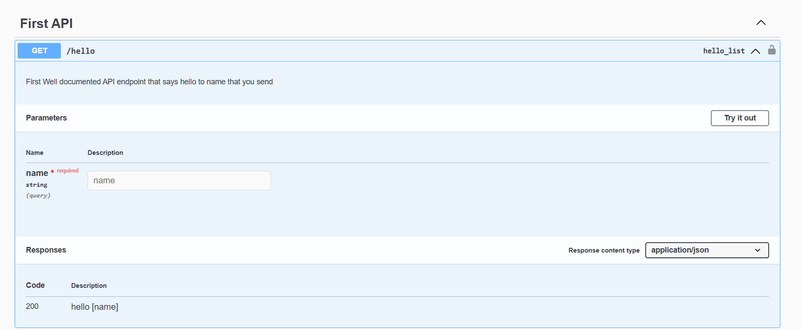

# Simple Django Rest Framework

Simple Django Rest Framework is django based app used to provide abstraction that combines both django rest framework with drf_yasg a swagger generator to implement good looking and  well documented apis using djang


## Quick Start

### Install
1. assuming you already have a django project that you need to add this app to you need to start with installing the package using
```
pip install sdrf
```
2. install required apps to INSTALLED_APPS in django settings
```python
INSTALLED_APPS = [
    ...
    "rest_framework",
    "drf_yasg",
    'sdrf',
]
```
3. add swagger docs url to your project urls
```python
from django.contrib import admin
from django.urls import path,include

urlpatterns = [
    ...
    path('',include('sdrf.urls'))
]
```
4. check out if everything is okay by visting default swagger docs url at ``http://<your-project-url>/rest``


### Configure
now you have an rest app up and running you can configure it as you want. addtionally for django rest framework configuration and drf_yasg configuration you have our sdrf configs you can make with these default values


| config variable name | default value | description |
| ------- | ------ | ----- |
| REST_APP_NAME | `Weather API` | the app name used in swagger docs view |
| REST_APP_VERSION | `v1` | the api version used in swagger docs view |
| REST_APP_CREATOR | ``{'name': '','email': '','url': ''}`` | the contact information for communicating the rest app creator used in swagger docs view |
| REST_APP_BASE_URL | `rest/` | the base url that the swagger docs will be viewd on and a prefix for default api endpoint |
### Build API Endpoints
1. assuming you have an django app that already exsist create and an API endpoint class that inheiret APIEndPoint class for example see out hello world here
```python
from sdrf.api_endpoint import APIEndpoint
from sdrf.endpoint_config import APIEndpointConfig


class HelloEndPoint(APIEndpoint):
    def configure(self, config: APIEndpointConfig) -> APIEndpointConfig:
        ...
        return config

    @staticmethod
    def execute(request: Request, *args, **kwargs) -> Response:
        name = request.query_params.get('name')
        return HttpResponse(f'Hello {name}')

```
2. configure your api endpoint using configure method, in this method you have all sort of configuration that you can configure for your rest api even the auhentication and authorization configurations, http method, routing, and swagger view configs simplified with easy and nice looking config code
```python
from sdrf.api_endpoint import APIEndpoint
from sdrf.endpoint_config import APIEndpointConfig


class HelloEndPoint(APIEndpoint):
    def configure(self, config: APIEndpointConfig) -> APIEndpointConfig:
        config.name = 'Hello Rest!'
        config.description= """
        First Well documented API endpoint that says hello to name that you send
        """
        config.endpoint= 'hello'
        config.http_method = 'GET'
        config.set_response(200,'hello [name]')
        config.add_parameter('name',self.DataType.STRING,self.ParameterTypes.QUERY_PARAM)
        config.add_tag('First API')
        return config

    @staticmethod
    def execute(request: Request, *args, **kwargs) -> Response:
        name = request.query_params.get('name')
        return HttpResponse(f'Hello {name}')

```
3. finally add your api endpoint to your app urls using as_url static method
```python
from .views import HelloEndPoint

urlpatterns = [
    HelloEndPoint.as_url()
]
```

4. check your output and test your api in the swagger view




